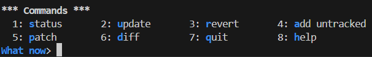

# Git

## Concepts

- staging: selecting changes you want to include in your next commit.
- committing: saving changes to your local repository (inside .git folder).

## Commands
git init : initialize a git repository.

git add <filepath/filename>
- git add `*pattern* ` e.g., git add `*con*` it will find the files with the name "con" and stage them.

git add . : add all the file to be tracked and staged.

git add -i : interactive git add mode

git reset <filepath/filename>: unstage a file.

git reset . : reset all the tracked file / unstage all file

git reset HEAD~1 : reset commit

git status : check working directory and staging area (what you have added)

git show : see the last commit and verify that the message is fixed
git show HEAD: show the commit of the HEAD alias.
git show \<SHA>\ : show the commit of a specific SHA.
git show HEAD^ : go back previous commit (provided the current commit is not the first commit).
git commit -m "commit-message"
git commit --amend : open the terminal text editor to edit the commit message.
- x: delete single character (based on where you move the arrow.)
- i: go into INSERT mode where you can correct more than one character.
- :wq: save and quit 

git log : show a list of commit (verbose).
git log --oneline : show a concise version of commit list.

> configure git log to output concise version:
> - git config format.pretty oneline : make each commit concise.
> - git config log.abbrevCommit true : ensure SHA is in abbreviated format.

## Sync Local and Remote Repositories

git remote add origin https://github.com/twx0504/git-testing.git
git branch -M main
git push -u origin main <!-- -u => upstream tracking: setting up a remote branch that your local branch is linked to, making it easier to synchronize changes between them. -->

git remote : view remote repository.

git remote -v: verbose version.

git branch : list all the local branches.

git branch -a : list all branches, including both local branches and remote-tracking branches.

git push : sync your local repository to your remote repository.